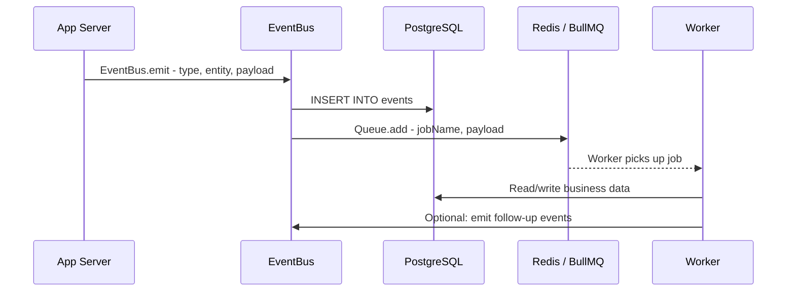
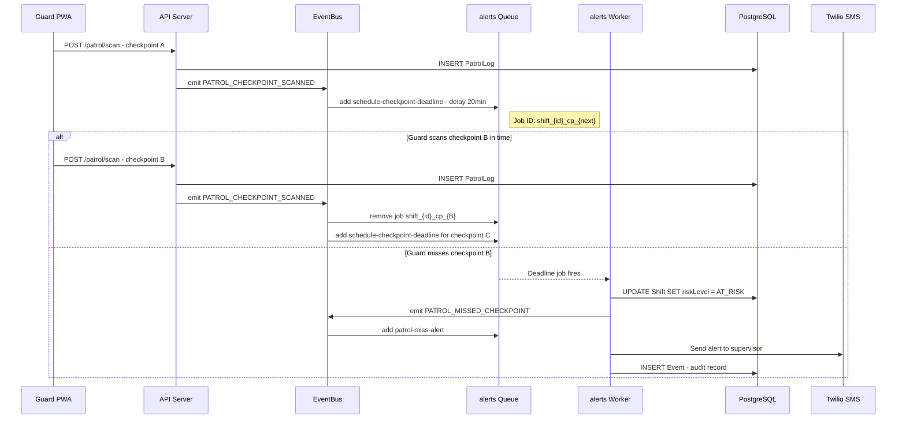
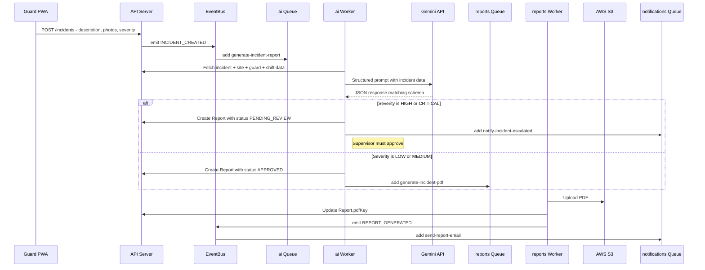
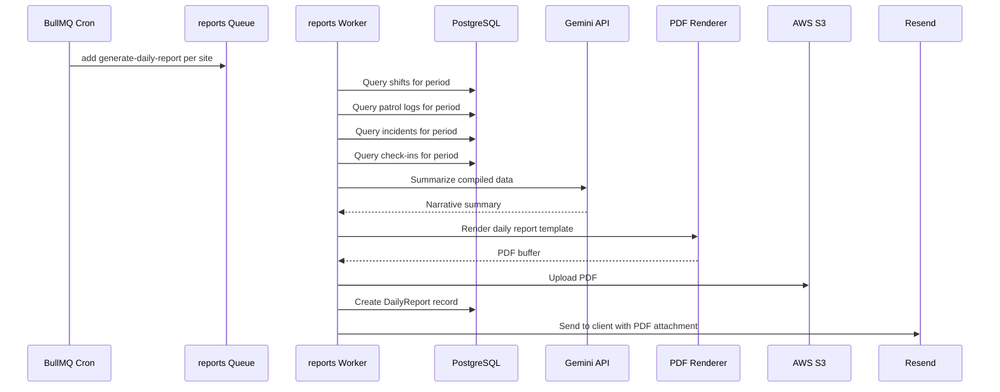
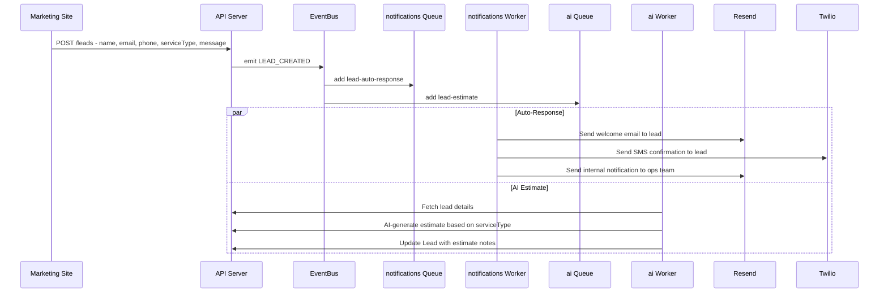
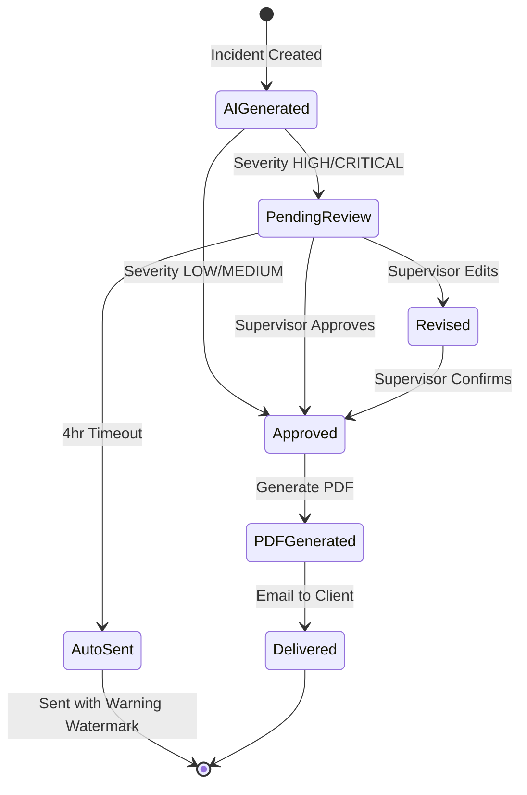
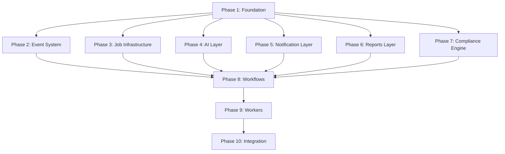
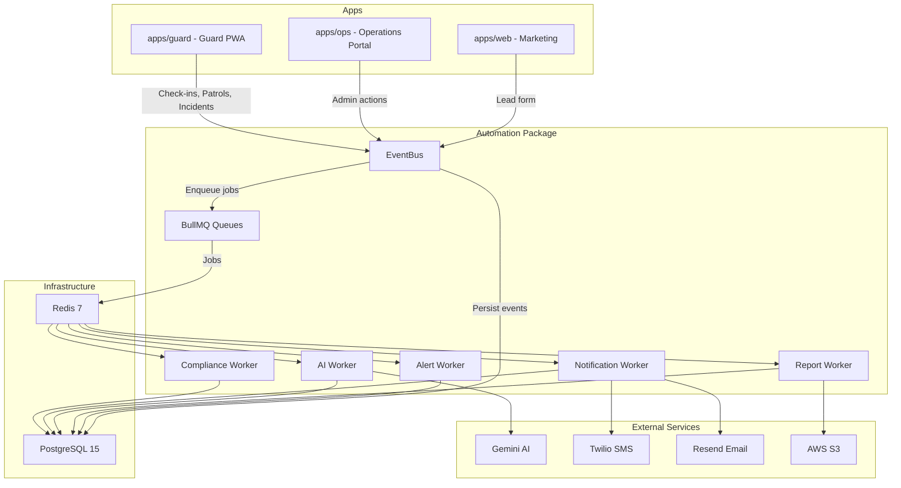

# Automation Stack Architecture

> `packages/automation` — Background jobs, AI report generation, event-driven workflows, and compliance scoring for the Over Time Security platform.

---

## Table of Contents

1. [Event Pipeline Architecture](#1-event-pipeline-architecture)
2. [Job Queue Architecture](#2-job-queue-architecture-bullmq--redis)
3. [Core Automations](#3-core-automations)
4. [AI Guardrails](#4-ai-guardrails)
5. [Notification Architecture](#5-notification-architecture)
6. [File Structure](#6-file-structure)
7. [Schema Additions](#7-schema-additions)
8. [Dependencies](#8-dependencies)
9. [Environment Variables](#9-environment-variables)
10. [Build Order](#10-build-order)

---

## 1. Event Pipeline Architecture

### 1.1 Event Model

A new `Event` model stores every domain event as an immutable audit log. Every mutation in the system emits an event, providing a complete audit trail and the trigger mechanism for async workflows.

```prisma
enum EventType {
  GUARD_CHECKED_IN
  GUARD_CHECKED_OUT
  PATROL_STARTED
  PATROL_CHECKPOINT_SCANNED
  PATROL_MISSED_CHECKPOINT
  INCIDENT_CREATED
  INCIDENT_ESCALATED
  SHIFT_STARTED
  SHIFT_ENDED
  SHIFT_NO_SHOW
  REPORT_GENERATED
  REPORT_SENT
  LEAD_CREATED
  LEAD_STATUS_CHANGED
  COMPLIANCE_RECALCULATED
  NOTIFICATION_SENT
  NOTIFICATION_FAILED
}

enum ActorType {
  GUARD
  SUPERVISOR
  ADMIN
  CLIENT
  SYSTEM
}

model Event {
  id         String    @id @default(cuid())
  type       EventType
  entityType String    @map("entity_type")   // e.g. "Shift", "Incident", "PatrolLog"
  entityId   String    @map("entity_id")     // ID of the affected record
  payload    Json      @default("{}")        // Arbitrary JSON context
  actorId    String?   @map("actor_id")      // Who triggered it (null for SYSTEM)
  actorType  ActorType @default(SYSTEM)      @map("actor_type")
  createdAt  DateTime  @default(now())       @map("created_at")

  @@index([type])
  @@index([entityType, entityId])
  @@index([actorId])
  @@index([createdAt])
  @@map("events")
}
```

### 1.2 Event Types Reference

| Event Type | Trigger Condition | Entity Type | Typical Actor |
|---|---|---|---|
| `GUARD_CHECKED_IN` | Guard clocks in via PWA | `CheckIn` | `GUARD` |
| `GUARD_CHECKED_OUT` | Guard clocks out via PWA | `CheckIn` | `GUARD` |
| `PATROL_STARTED` | First checkpoint scan of a patrol round | `PatrolLog` | `GUARD` |
| `PATROL_CHECKPOINT_SCANNED` | Guard scans any checkpoint | `PatrolLog` | `GUARD` |
| `PATROL_MISSED_CHECKPOINT` | Expected checkpoint not scanned within window | `PatrolLog` | `SYSTEM` |
| `INCIDENT_CREATED` | Guard submits incident report | `Incident` | `GUARD` |
| `INCIDENT_ESCALATED` | Severity upgraded or supervisor notified | `Incident` | `SUPERVISOR` / `SYSTEM` |
| `SHIFT_STARTED` | Shift transitions to `IN_PROGRESS` | `Shift` | `SYSTEM` |
| `SHIFT_ENDED` | Shift transitions to `COMPLETED` | `Shift` | `SYSTEM` |
| `SHIFT_NO_SHOW` | Shift start time passes with no check-in | `Shift` | `SYSTEM` |
| `REPORT_GENERATED` | AI report created for incident | `Report` | `SYSTEM` |
| `REPORT_SENT` | Report emailed to client | `Report` | `SYSTEM` |
| `LEAD_CREATED` | New lead submitted via web form | `Lead` | `CLIENT` |
| `LEAD_STATUS_CHANGED` | Lead pipeline stage changes | `Lead` | `SUPERVISOR` / `ADMIN` |
| `COMPLIANCE_RECALCULATED` | Site compliance score recomputed | `Site` | `SYSTEM` |
| `NOTIFICATION_SENT` | SMS/email delivered successfully | `Notification` | `SYSTEM` |
| `NOTIFICATION_FAILED` | SMS/email delivery failed | `Notification` | `SYSTEM` |

### 1.3 EventBus Pattern

The [`EventBus`](packages/automation/src/events/bus.ts) is an in-process TypeScript class that coordinates two side effects for every emitted event:

1. **Persist** — Write an `Event` row to PostgreSQL for audit/replay
2. **Enqueue** — Push a BullMQ job for any async reactions mapped to that event type

```typescript
// packages/automation/src/events/bus.ts
import { PrismaClient, EventType, ActorType } from "@ots/db";
import { Queue } from "bullmq";

interface EmitOptions {
  type: EventType;
  entityType: string;
  entityId: string;
  payload?: Record<string, unknown>;
  actorId?: string;
  actorType?: ActorType;
}

class EventBus {
  constructor(
    private prisma: PrismaClient,
    private queues: Record<string, Queue>
  ) {}

  async emit(options: EmitOptions): Promise<string> {
    // 1. Persist event
    const event = await this.prisma.event.create({
      data: {
        type: options.type,
        entityType: options.entityType,
        entityId: options.entityId,
        payload: options.payload ?? {},
        actorId: options.actorId ?? null,
        actorType: options.actorType ?? "SYSTEM",
      },
    });

    // 2. Enqueue jobs based on event-to-job mapping
    const jobs = EVENT_JOB_MAP[options.type] ?? [];
    await Promise.all(
      jobs.map((job) =>
        this.queues[job.queue].add(job.name, {
          eventId: event.id,
          ...options.payload,
        }, job.options)
      )
    );

    return event.id;
  }
}
```

### 1.4 Data Flow



### 1.5 Event-to-Job Mapping

The [`handlers.ts`](packages/automation/src/events/handlers.ts) file defines a static mapping from each event type to the jobs it triggers:

| Event Type | Queue | Job Name | Delay |
|---|---|---|---|
| `GUARD_CHECKED_IN` | `compliance` | `recalculate-compliance` | — |
| `PATROL_CHECKPOINT_SCANNED` | `alerts` | `schedule-checkpoint-deadline` | — |
| `PATROL_MISSED_CHECKPOINT` | `alerts` | `patrol-miss-alert` | — |
| `INCIDENT_CREATED` | `ai` | `generate-incident-report` | — |
| `INCIDENT_CREATED` | `notifications` | `notify-incident-created` | — |
| `INCIDENT_ESCALATED` | `notifications` | `notify-incident-escalated` | — |
| `SHIFT_NO_SHOW` | `alerts` | `shift-no-show-alert` | — |
| `SHIFT_NO_SHOW` | `notifications` | `notify-shift-no-show` | — |
| `SHIFT_ENDED` | `compliance` | `recalculate-compliance` | — |
| `REPORT_GENERATED` | `notifications` | `send-report-email` | — |
| `LEAD_CREATED` | `notifications` | `lead-auto-response` | — |
| `LEAD_CREATED` | `ai` | `lead-estimate` | — |

---

## 2. Job Queue Architecture (BullMQ + Redis)

### 2.1 Infrastructure

BullMQ connects to the existing Redis 7 instance defined in [`docker-compose.yml`](docker/docker-compose.yml) at `localhost:6379`. A shared `IORedis` connection is created once and passed to all queues and workers.

```typescript
// packages/automation/src/jobs/connection.ts
import IORedis from "ioredis";

export const redisConnection = new IORedis(
  process.env.REDIS_URL ?? "redis://localhost:6379",
  { maxRetriesPerRequest: null }
);
```

### 2.2 Queue Definitions

| Queue Name | Purpose | Concurrency | Rate Limit |
|---|---|---|---|
| `alerts` | Real-time alerting — patrol misses, no-shows, escalations | 5 | — |
| `reports` | PDF generation and daily report compilation | 2 | — |
| `ai` | Gemini API calls for report generation and lead estimates | 2 | 10/min |
| `notifications` | SMS via Twilio, email via Resend | 5 | 30/min |
| `compliance` | Compliance score recalculation | 3 | — |

```typescript
// packages/automation/src/jobs/queues.ts
import { Queue } from "bullmq";
import { redisConnection } from "./connection";

export const alertsQueue = new Queue("alerts", {
  connection: redisConnection,
  defaultJobOptions: { attempts: 3, backoff: { type: "exponential", delay: 2000 } },
});

export const reportsQueue = new Queue("reports", {
  connection: redisConnection,
  defaultJobOptions: { attempts: 2, backoff: { type: "exponential", delay: 5000 } },
});

export const aiQueue = new Queue("ai", {
  connection: redisConnection,
  defaultJobOptions: {
    attempts: 1,
    removeOnComplete: { count: 100 },
    removeOnFail: { count: 500 },
  },
});

export const notificationsQueue = new Queue("notifications", {
  connection: redisConnection,
  defaultJobOptions: { attempts: 3, backoff: { type: "exponential", delay: 3000 } },
});

export const complianceQueue = new Queue("compliance", {
  connection: redisConnection,
  defaultJobOptions: {
    attempts: 2,
    backoff: { type: "exponential", delay: 2000 },
    // Deduplicate: only one recalculation per site within 60s
  },
});
```

### 2.3 Job Types per Queue

#### `alerts` Queue

| Job Name | Payload | Description |
|---|---|---|
| `patrol-miss-alert` | `{ shiftId, siteId, guardId, checkpointName, expectedBy }` | Fires when a checkpoint scan deadline passes |
| `schedule-checkpoint-deadline` | `{ shiftId, siteId, guardId, nextCheckpoint, deadlineMs }` | Schedules a delayed job that becomes a miss if not canceled |
| `shift-no-show-alert` | `{ shiftId, guardId, siteId, shiftStartTime }` | Guard did not check in within grace period |

#### `reports` Queue

| Job Name | Payload | Description |
|---|---|---|
| `generate-daily-report` | `{ siteId, clientId, periodStart, periodEnd }` | Compile and generate daily summary PDF |
| `generate-incident-pdf` | `{ reportId, incidentId }` | Render incident report to PDF and upload to S3 |

#### `ai` Queue

| Job Name | Payload | Description |
|---|---|---|
| `generate-incident-report` | `{ incidentId, eventId }` | Call Gemini to produce structured incident report |
| `lead-estimate` | `{ leadId }` | AI-generated service estimate from lead details |

#### `notifications` Queue

| Job Name | Payload | Description |
|---|---|---|
| `lead-auto-response` | `{ leadId }` | Send welcome email + SMS to new lead |
| `notify-incident-created` | `{ incidentId, siteId }` | SMS supervisor about new incident |
| `notify-incident-escalated` | `{ incidentId, severity }` | Escalation chain notification |
| `notify-shift-no-show` | `{ shiftId, guardId, siteId }` | Alert supervisor of no-show |
| `send-report-email` | `{ reportId, recipientEmail }` | Email report PDF to client |

#### `compliance` Queue

| Job Name | Payload | Description |
|---|---|---|
| `recalculate-compliance` | `{ siteId, triggeredBy }` | Recompute compliance score for a site |

### 2.4 Retry Strategy

| Queue | Max Attempts | Backoff Type | Backoff Delay | Rationale |
|---|---|---|---|---|
| `alerts` | 3 | Exponential | 2s base | Time-sensitive but can retry quickly |
| `reports` | 2 | Exponential | 5s base | PDF generation is idempotent |
| `ai` | 1 | — | — | AI calls are expensive; fall back to manual on failure |
| `notifications` | 3 | Exponential | 3s base | External services may have transient failures |
| `compliance` | 2 | Exponential | 2s base | Pure computation, low cost to retry |

### 2.5 Dead Letter Queue Handling

Jobs that exhaust all retries are moved to a dead letter state within BullMQ. A dedicated handler logs the failure, creates an `Event` with type relevant to the failure context, and optionally pings a monitoring webhook:

```typescript
// In each worker's failed handler
worker.on("failed", async (job, err) => {
  if (job && job.attemptsMade >= (job.opts.attempts ?? 1)) {
    // Log to structured logger
    logger.error("Job permanently failed", {
      queue: worker.name,
      jobName: job.name,
      jobId: job.id,
      payload: job.data,
      error: err.message,
    });

    // Persist failure event for audit
    await eventBus.emit({
      type: EventType.NOTIFICATION_FAILED,
      entityType: "Job",
      entityId: job.id ?? "unknown",
      payload: { queue: worker.name, jobName: job.name, error: err.message },
    });
  }
});
```

### 2.6 Cron Jobs

BullMQ repeatable jobs handle scheduled work:

| Cron Expression | Queue | Job Name | Description |
|---|---|---|---|
| `0 6 * * *` | `reports` | `generate-daily-report` | Daily report at 06:00 local per site |
| `*/5 * * * *` | `alerts` | `check-shift-no-shows` | Every 5 min: find shifts past start with no check-in |
| `0 0 * * *` | `compliance` | `batch-recalculate` | Nightly full compliance recalculation |

---

## 3. Core Automations

### 3.1 Patrol Miss Alert

**Purpose**: Detect when a guard fails to scan an expected checkpoint within the allowed time window and alert the supervisor immediately.

#### Detection Strategy: Delayed Job Cancellation

Rather than polling, use a proactive delayed-job pattern:

1. When `PATROL_CHECKPOINT_SCANNED` fires, the handler looks up the next expected checkpoint for this shift from the site configuration
2. A delayed BullMQ job `schedule-checkpoint-deadline` is enqueued with a delay equal to the checkpoint interval + grace period
3. When the guard scans the next checkpoint, the pending deadline job is canceled by its deterministic job ID
4. If the deadline job fires without cancellation, it transitions into `patrol-miss-alert`

#### Flow Diagram



#### Actions on Miss

1. **SMS Supervisor** — Twilio message: "PATROL ALERT: Guard {name} missed checkpoint {checkpointName} at {siteName}. Shift #{shiftId}. Expected by {expectedTime}."
2. **Mark Shift at Risk** — Set `Shift.riskLevel` to `AT_RISK`
3. **Create Audit Event** — `PATROL_MISSED_CHECKPOINT` event persisted with full context
4. **Dashboard Notification** — Real-time update pushed to ops portal via polling or future WebSocket

#### Configuration

| Parameter | Default | Description |
|---|---|---|
| `PATROL_CHECKPOINT_INTERVAL_MIN` | `15` | Minutes between expected checkpoints |
| `PATROL_GRACE_PERIOD_MIN` | `5` | Additional minutes before flagging a miss |
| `PATROL_MISS_SMS_ENABLED` | `true` | Toggle SMS alerts |

---

### 3.2 Incident AI Report

**Purpose**: When a guard reports an incident, automatically generate a professional narrative report using Gemini AI, create a PDF, upload to S3, and optionally route for supervisor approval.

#### Trigger

`INCIDENT_CREATED` event → `ai` queue → `generate-incident-report` job

#### Flow Diagram



#### AI Prompt Template

```typescript
// packages/automation/src/ai/prompts.ts

export function incidentReportPrompt(data: IncidentReportInput): string {
  return `You are a professional security report writer for Over Time Security, 
a California-based private security firm.

Generate a structured incident report using ONLY the provided data fields. 
Do not invent, assume, or fabricate any details not present in the input.

## Input Data

- Incident ID: ${data.incidentId}
- Type: ${data.type}
- Severity: ${data.severity}
- Description: ${data.description}
- Occurred At: ${data.occurredAt}
- Site: ${data.siteName} (${data.siteLocation})
- Guard: ${data.guardName} (License: ${data.guardLicense})
- Shift: ${data.shiftStart} to ${data.shiftEnd}
- Photos Attached: ${data.photoCount}
- Client: ${data.clientName}

## Output Requirements

Return a JSON object matching this exact schema:
{
  "summary": "2-3 sentence executive summary",
  "clientSafeSummary": "Summary suitable for client-facing communication, no internal details",
  "recommendedActions": ["Action 1", "Action 2", ...],
  "escalationRequired": true/false,
  "severityAssessment": "Your assessment of actual severity based on description",
  "narrative": "Detailed professional narrative, 2-4 paragraphs",
  "sourceFields": ["list of input field names actually referenced in your output"]
}

## Rules
- Reference ONLY the fields provided above
- If description is vague, note that in the report rather than speculating
- recommendedActions must be specific and actionable
- Set escalationRequired to true if: injuries, weapons, property damage over $1000, or repeat incidents
- sourceFields must honestly list which input fields you used`;
}
```

#### Structured Output Schema

```typescript
// packages/automation/src/ai/schemas.ts
import { z } from "zod";

export const IncidentReportOutputSchema = z.object({
  summary: z.string().min(20).max(500),
  clientSafeSummary: z.string().min(20).max(500),
  recommendedActions: z.array(z.string().min(5)).min(1).max(10),
  escalationRequired: z.boolean(),
  severityAssessment: z.enum(["LOW", "MEDIUM", "HIGH", "CRITICAL"]),
  narrative: z.string().min(50).max(3000),
  sourceFields: z.array(z.string()).min(1),
});

export type IncidentReportOutput = z.infer<typeof IncidentReportOutputSchema>;
```

#### Supervisor Approval Gate

For `HIGH` or `CRITICAL` severity incidents:

1. Report is created with `status: PENDING_REVIEW` in the database
2. Supervisor receives push/SMS notification with link to review
3. Supervisor approves or edits in the ops portal
4. On approval, PDF generation and client delivery proceed
5. 4-hour timeout: if no review occurs, auto-send with a `[PENDING REVIEW]` watermark and escalate to admin

---

### 3.3 Daily Report Generator

**Purpose**: Compile a comprehensive daily security summary per site/client, generate a professional PDF, and email it to the client each morning.

#### Trigger

BullMQ repeatable job: `0 6 * * *` (default 06:00 local). Each site can override the schedule and timezone via configuration stored in the `Site` model or a separate `SiteConfig` table.

#### Flow Diagram



#### Data Compilation

The worker queries the following for the 24-hour period (default: previous day 06:00 to current day 06:00):

| Data Source | Query | Fields Used |
|---|---|---|
| `Shift` | All shifts overlapping the period for the site | guard, startTime, endTime, status |
| `CheckIn` | All check-ins for shifts in this period | timestamp, type inference from notes |
| `PatrolLog` | All patrol logs for shifts in this period | checkpointName, timestamp, notes |
| `Incident` | All incidents at this site in this period | type, severity, description, report |
| `ComplianceScore` | Latest score for the site | overall, components |

#### PDF Template Structure

Generated using `@react-pdf/renderer` with the following layout:

```
┌─────────────────────────────────────────┐
│  OVER TIME SECURITY — Daily Report      │
│  Site: {siteName}                       │
│  Period: {startDate} — {endDate}        │
│  Generated: {timestamp}                 │
├─────────────────────────────────────────┤
│  EXECUTIVE SUMMARY                      │
│  AI-generated narrative summary of the  │
│  24-hour period                         │
├─────────────────────────────────────────┤
│  SHIFT SUMMARY TABLE                    │
│  Guard | Start | End | Status | Hours   │
│  ────────────────────────────────────   │
│  ...rows...                             │
├─────────────────────────────────────────┤
│  PATROL COMPLETION                      │
│  Total Checkpoints Expected: X          │
│  Total Checkpoints Scanned: Y           │
│  Completion Rate: Z%                    │
│  Missed Checkpoints: [list]             │
├─────────────────────────────────────────┤
│  INCIDENTS                              │
│  (if any) Per-incident: type, severity, │
│  description, AI summary, photos        │
├─────────────────────────────────────────┤
│  COVERAGE HEALTH SCORE                  │
│  Overall: XX/100                        │
│  Breakdown gauges per component         │
├─────────────────────────────────────────┤
│  Footer: Confidential | Page X of Y    │
└─────────────────────────────────────────┘
```

---

### 3.4 Lead Intake Automation

**Purpose**: When a potential client submits a quote request through the marketing site, automatically acknowledge the lead, notify the operations team, and optionally generate an AI-powered service estimate.

#### Trigger

`LEAD_CREATED` event from the web app's quote form submission.

#### Flow Diagram



#### Email Templates

Built with React Email for maintainable, responsive templates:

| Template | Recipient | Content |
|---|---|---|
| `lead-welcome.tsx` | Lead email | Thank you, expected response time, company overview |
| `lead-sms-confirm.txt` | Lead phone | "Thanks for contacting Over Time Security. We will reach out within 2 business hours." |
| `lead-internal-notify.tsx` | Ops team | Lead details, service type, suggested actions, AI estimate |

#### AI Estimate Logic

Based on `serviceType` and `message` content, Gemini generates:

- Estimated guard count
- Recommended service tier
- Rough cost range (based on public California security guard rates)
- Suggested follow-up questions for the sales call

This estimate is stored as JSON in the lead record and surfaced in the ops portal for the sales team.

---

### 3.5 Compliance Score Engine

**Purpose**: Calculate a weighted "Coverage Health" score per site, giving clients and supervisors a single metric for security coverage quality.

#### Score Composition

| Component | Weight | Calculation | Range |
|---|---|---|---|
| Patrol Completion | 40% | `scannedCheckpoints / expectedCheckpoints * 100` | 0-100 |
| Incident Frequency Inverse | 20% | `max(0, 100 - incidentCount * 10)` | 0-100 |
| Check-in Consistency | 25% | `onTimeCheckIns / totalExpectedCheckIns * 100` | 0-100 |
| Report Timeliness | 15% | `reportsGeneratedWithin1hr / totalReports * 100` | 0-100 |

**Overall Score** = `(patrol * 0.40) + (incident * 0.20) + (checkIn * 0.25) + (report * 0.15)`

#### Scoring Windows

- **Default window**: Rolling 30 days
- **Recalculation triggers**:
  - End of each shift (`SHIFT_ENDED` event)
  - Nightly batch job at midnight
  - Manual trigger from ops portal

#### Implementation

```typescript
// packages/automation/src/compliance/score.ts

interface ComplianceComponents {
  patrolCompletion: number;    // 0-100
  incidentFrequency: number;   // 0-100
  checkInConsistency: number;  // 0-100
  reportTimeliness: number;    // 0-100
}

interface ComplianceResult {
  siteId: string;
  overall: number;             // 0-100
  grade: "A" | "B" | "C" | "D" | "F";
  components: ComplianceComponents;
  window: { start: Date; end: Date };
  calculatedAt: Date;
}

function calculateGrade(score: number): string {
  if (score >= 90) return "A";
  if (score >= 80) return "B";
  if (score >= 70) return "C";
  if (score >= 60) return "D";
  return "F";
}
```

#### Storage

The `ComplianceScore` model stores snapshots so historical trends can be tracked:

```prisma
model ComplianceScore {
  id                 String   @id @default(cuid())
  siteId             String   @map("site_id")
  site               Site     @relation(fields: [siteId], references: [id])
  overall            Float
  grade              String   // A, B, C, D, F
  patrolCompletion   Float    @map("patrol_completion")
  incidentFrequency  Float    @map("incident_frequency")
  checkInConsistency Float    @map("check_in_consistency")
  reportTimeliness   Float    @map("report_timeliness")
  windowStart        DateTime @map("window_start")
  windowEnd          DateTime @map("window_end")
  calculatedAt       DateTime @default(now()) @map("calculated_at")

  @@index([siteId, calculatedAt])
  @@map("compliance_scores")
}
```

#### Client Portal Display

Surfaced as a "Coverage Health" gauge in the client portal (`apps/ops`) with:

- Large circular gauge showing overall score with color coding (green ≥ 80, yellow ≥ 60, red < 60)
- Four sub-gauges for each component
- 30-day trend sparkline
- Grade badge (A through F)

---

## 4. AI Guardrails

### 4.1 Prompt Engineering Rules

All AI prompts follow these constraints enforced in [`guardrails.ts`](packages/automation/src/ai/guardrails.ts):

1. **System prompt preamble** — Every call includes: *"You are an AI assistant for Over Time Security. Only reference data fields explicitly provided in the prompt. Do not speculate, fabricate, or hallucinate details."*
2. **Data boundary enforcement** — Input fields are enumerated in the prompt; the AI must not reference anything outside them
3. **Source tracking** — Every AI output must include `sourceFields: string[]` listing which input fields were actually used
4. **No PII invention** — AI must not generate names, phone numbers, or addresses not provided in input

### 4.2 Structured Output Validation

All Gemini API calls use JSON mode with Zod post-validation:

```typescript
// packages/automation/src/ai/client.ts
import { GoogleGenerativeAI } from "@google/generative-ai";
import { z } from "zod";

async function generateStructuredOutput<T>(
  prompt: string,
  schema: z.ZodSchema<T>,
  options?: { temperature?: number }
): Promise<{ data: T; raw: string }> {
  const genAI = new GoogleGenerativeAI(process.env.GEMINI_API_KEY!);
  const model = genAI.getGenerativeModel({
    model: "gemini-1.5-flash",
    generationConfig: {
      responseMimeType: "application/json",
      temperature: options?.temperature ?? 0.3,
    },
  });

  const result = await model.generateContent(prompt);
  const raw = result.response.text();
  const parsed = JSON.parse(raw);
  const validated = schema.parse(parsed);  // Throws ZodError if invalid

  return { data: validated, raw };
}
```

### 4.3 Supervisor Approval Workflow

For incidents with severity `HIGH` or `CRITICAL`:



### 4.4 Fallback Strategy

If an AI call fails (API error, rate limit, Zod validation failure):

1. Create the `Report` record with `content` set to a raw-fields template (structured but not narrative)
2. Set `Report.status` to `NEEDS_MANUAL_REVIEW`
3. Flag in ops portal dashboard
4. Emit `REPORT_GENERATED` event with `payload.aiGenerated: false`
5. Supervisor writes or edits the narrative manually

### 4.5 Rate Limiting and Cost Tracking

| Control | Implementation |
|---|---|
| Request rate limit | BullMQ queue rate limiter: max 10 AI jobs/minute |
| Token budget | Log input/output token counts per call to `Event.payload` |
| Monthly cost cap | Environment variable `AI_MONTHLY_BUDGET_USD`; worker skips AI and falls back to manual when exceeded |
| Cost dashboard | Aggregate token usage from events table, surface in ops admin panel |

---

## 5. Notification Architecture

### 5.1 Channels

| Channel | Provider | Package | Status |
|---|---|---|---|
| Email | Resend | `resend` | Planned |
| SMS | Twilio | `twilio` | Planned |
| Push | Web Push API | — | Future |

### 5.2 Notification Model

```prisma
enum NotificationChannel {
  EMAIL
  SMS
  PUSH
}

enum NotificationStatus {
  QUEUED
  SENT
  DELIVERED
  FAILED
}

model Notification {
  id          String              @id @default(cuid())
  channel     NotificationChannel
  recipient   String              // email address or phone number
  subject     String?             // email subject or SMS preview
  body        String              // rendered content
  status      NotificationStatus  @default(QUEUED)
  externalId  String?             @map("external_id") // Twilio SID or Resend ID
  sentAt      DateTime?           @map("sent_at")
  deliveredAt DateTime?           @map("delivered_at")
  failedAt    DateTime?           @map("failed_at")
  failReason  String?             @map("fail_reason")
  relatedType String?             @map("related_type") // e.g. "Incident", "Lead"
  relatedId   String?             @map("related_id")
  createdAt   DateTime            @default(now()) @map("created_at")

  @@index([channel, status])
  @@index([relatedType, relatedId])
  @@map("notifications")
}
```

### 5.3 Notification Preferences

Stored per user/client on their respective models or a separate `NotificationPreference` table:

| Preference | Options | Default |
|---|---|---|
| Incident alerts | Email, SMS, Both, None | Both |
| Daily reports | Email, None | Email |
| Lead notifications (ops) | Email, SMS, Both | Email |
| Shift no-show alerts | SMS, Email, Both | SMS |
| Patrol miss alerts | SMS, Email, Both | SMS |

### 5.4 Template System

Templates are organized by channel and purpose:

```
src/notifications/templates/
├── email/
│   ├── lead-welcome.tsx        # React Email template
│   ├── lead-internal.tsx       # Internal ops notification
│   ├── daily-report.tsx        # Daily report delivery
│   ├── incident-alert.tsx      # Incident notification
│   └── report-delivery.tsx     # Report PDF delivery
└── sms/
    ├── lead-confirm.ts         # Plain text SMS
    ├── patrol-miss.ts          # Alert SMS
    ├── shift-no-show.ts        # Alert SMS
    └── incident-alert.ts       # Alert SMS
```

### 5.5 Delivery Tracking

Every notification creates a `Notification` record before sending. The worker updates the record through its lifecycle:

```
QUEUED → SENT → DELIVERED (webhook confirmation)
                      └──→ FAILED (with failReason)
```

Resend and Twilio both support delivery webhooks that update the `Notification` status asynchronously.

---

## 6. File Structure

Complete planned structure for [`packages/automation/src/`](packages/automation/src/):

```
packages/automation/src/
├── index.ts                          # Barrel export: EventBus, queues, key types
│
├── events/
│   ├── types.ts                      # EventType enum mirror, payload type unions
│   ├── bus.ts                        # EventBus class implementation
│   └── handlers.ts                   # EVENT_JOB_MAP: event type → job definitions
│
├── jobs/
│   ├── index.ts                      # Job type registry + barrel export
│   ├── connection.ts                 # Shared IORedis connection
│   ├── queues.ts                     # Queue instances: alerts, reports, ai, notifications, compliance
│   └── types.ts                      # Job payload interfaces per queue
│
├── workers/
│   ├── alerts.worker.ts              # patrol-miss-alert, shift-no-show-alert, schedule-checkpoint-deadline
│   ├── reports.worker.ts             # generate-daily-report, generate-incident-pdf
│   ├── ai.worker.ts                  # generate-incident-report, lead-estimate
│   ├── notifications.worker.ts       # lead-auto-response, send-report-email, notify-*
│   └── compliance.worker.ts          # recalculate-compliance, batch-recalculate
│
├── ai/
│   ├── client.ts                     # Gemini client wrapper with structured output
│   ├── prompts.ts                    # Prompt template functions
│   ├── schemas.ts                    # Zod schemas for AI output validation
│   └── guardrails.ts                 # Source field validation, PII checks, fallback logic
│
├── notifications/
│   ├── sms.ts                        # Twilio client wrapper
│   ├── email.ts                      # Resend client wrapper
│   └── templates/
│       ├── email/
│       │   ├── lead-welcome.tsx      # New lead welcome email
│       │   ├── lead-internal.tsx     # Internal ops alert for new lead
│       │   ├── daily-report.tsx      # Daily report delivery wrapper
│       │   ├── incident-alert.tsx    # Incident notification
│       │   └── report-delivery.tsx   # Report PDF delivery
│       └── sms/
│           ├── lead-confirm.ts       # SMS text for lead confirmation
│           ├── patrol-miss.ts        # SMS text for patrol miss
│           ├── shift-no-show.ts      # SMS text for no-show
│           └── incident-alert.ts     # SMS text for incident
│
├── reports/
│   ├── daily.ts                      # Daily report data compiler
│   ├── incident.ts                   # Incident report data compiler
│   └── pdf.ts                        # @react-pdf/renderer templates + generation
│
├── compliance/
│   └── score.ts                      # Weighted score calculation engine
│
└── workflows/
    ├── patrol-miss.ts                # Orchestrates the full patrol miss flow
    ├── incident-report.ts            # Orchestrates incident → AI → PDF → email
    ├── daily-report.ts               # Orchestrates daily compilation → PDF → email
    ├── lead-intake.ts                # Orchestrates lead → email + SMS + AI estimate
    └── compliance-check.ts           # Orchestrates score recalculation + event emission
```

### Module Responsibility Boundaries

| Directory | Responsibility | Depends On |
|---|---|---|
| `events/` | Event type definitions, EventBus, event-to-job mapping | `@ots/db`, `bullmq` |
| `jobs/` | Queue configuration, Redis connection, job payload types | `bullmq`, `ioredis` |
| `workers/` | BullMQ Worker instances processing jobs | `events/`, `jobs/`, `workflows/` |
| `ai/` | Gemini integration, prompt engineering, output validation | `@google/generative-ai`, `zod` |
| `notifications/` | Channel-specific send logic and templates | `resend`, `twilio` |
| `reports/` | Data compilation and PDF rendering | `@react-pdf/renderer`, `@ots/db` |
| `compliance/` | Score calculation logic | `@ots/db`, `date-fns` |
| `workflows/` | End-to-end orchestration composing other modules | All above |

---

## 7. Schema Additions

### 7.1 New Models

Add these to [`packages/db/prisma/schema.prisma`](packages/db/prisma/schema.prisma):

#### Event Model

```prisma
enum EventType {
  GUARD_CHECKED_IN
  GUARD_CHECKED_OUT
  PATROL_STARTED
  PATROL_CHECKPOINT_SCANNED
  PATROL_MISSED_CHECKPOINT
  INCIDENT_CREATED
  INCIDENT_ESCALATED
  SHIFT_STARTED
  SHIFT_ENDED
  SHIFT_NO_SHOW
  REPORT_GENERATED
  REPORT_SENT
  LEAD_CREATED
  LEAD_STATUS_CHANGED
  COMPLIANCE_RECALCULATED
  NOTIFICATION_SENT
  NOTIFICATION_FAILED
}

enum ActorType {
  GUARD
  SUPERVISOR
  ADMIN
  CLIENT
  SYSTEM
}

model Event {
  id         String    @id @default(cuid())
  type       EventType
  entityType String    @map("entity_type")
  entityId   String    @map("entity_id")
  payload    Json      @default("{}")
  actorId    String?   @map("actor_id")
  actorType  ActorType @default(SYSTEM) @map("actor_type")
  createdAt  DateTime  @default(now()) @map("created_at")

  @@index([type])
  @@index([entityType, entityId])
  @@index([actorId])
  @@index([createdAt])
  @@map("events")
}
```

#### ComplianceScore Model

```prisma
model ComplianceScore {
  id                 String   @id @default(cuid())
  siteId             String   @map("site_id")
  site               Site     @relation(fields: [siteId], references: [id])
  overall            Float
  grade              String
  patrolCompletion   Float    @map("patrol_completion")
  incidentFrequency  Float    @map("incident_frequency")
  checkInConsistency Float    @map("check_in_consistency")
  reportTimeliness   Float    @map("report_timeliness")
  windowStart        DateTime @map("window_start")
  windowEnd          DateTime @map("window_end")
  calculatedAt       DateTime @default(now()) @map("calculated_at")

  @@index([siteId, calculatedAt])
  @@map("compliance_scores")
}
```

#### Notification Model

```prisma
enum NotificationChannel {
  EMAIL
  SMS
  PUSH
}

enum NotificationStatus {
  QUEUED
  SENT
  DELIVERED
  FAILED
}

model Notification {
  id          String              @id @default(cuid())
  channel     NotificationChannel
  recipient   String
  subject     String?
  body        String
  status      NotificationStatus  @default(QUEUED)
  externalId  String?             @map("external_id")
  sentAt      DateTime?           @map("sent_at")
  deliveredAt DateTime?           @map("delivered_at")
  failedAt    DateTime?           @map("failed_at")
  failReason  String?             @map("fail_reason")
  relatedType String?             @map("related_type")
  relatedId   String?             @map("related_id")
  createdAt   DateTime            @default(now()) @map("created_at")

  @@index([channel, status])
  @@index([relatedType, relatedId])
  @@map("notifications")
}
```

### 7.2 New Fields on Existing Models

#### Shift — Add `riskLevel`

```prisma
enum RiskLevel {
  NORMAL
  AT_RISK
  CRITICAL
}

// Add to Shift model:
model Shift {
  // ... existing fields ...
  riskLevel  RiskLevel @default(NORMAL) @map("risk_level")
}
```

#### Report — Add `status` and `aiMetadata`

```prisma
enum ReportStatus {
  GENERATING
  PENDING_REVIEW
  APPROVED
  NEEDS_MANUAL_REVIEW
  SENT
}

// Add to Report model:
model Report {
  // ... existing fields ...
  status      ReportStatus @default(GENERATING)
  aiMetadata  Json?        @map("ai_metadata")  // token counts, model, sourceFields
}
```

#### Site — Add `complianceScores` relation and config

```prisma
// Add to Site model:
model Site {
  // ... existing fields ...
  complianceScores ComplianceScore[]
  timezone         String            @default("America/Los_Angeles")
  reportSchedule   String?           @map("report_schedule")  // cron expression override
}
```

#### Lead — Add `estimateData`

```prisma
// Add to Lead model:
model Lead {
  // ... existing fields ...
  estimateData Json? @map("estimate_data")  // AI-generated estimate
}
```

### 7.3 Complete New Enums Summary

| Enum | Values |
|---|---|
| `EventType` | 17 values (see section 1.2) |
| `ActorType` | `GUARD`, `SUPERVISOR`, `ADMIN`, `CLIENT`, `SYSTEM` |
| `NotificationChannel` | `EMAIL`, `SMS`, `PUSH` |
| `NotificationStatus` | `QUEUED`, `SENT`, `DELIVERED`, `FAILED` |
| `RiskLevel` | `NORMAL`, `AT_RISK`, `CRITICAL` |
| `ReportStatus` | `GENERATING`, `PENDING_REVIEW`, `APPROVED`, `NEEDS_MANUAL_REVIEW`, `SENT` |

---

## 8. Dependencies

### 8.1 Production Dependencies

Add to [`packages/automation/package.json`](packages/automation/package.json) `dependencies`:

| Package | Version | Purpose |
|---|---|---|
| `bullmq` | `^5.0.0` | Job queue management |
| `ioredis` | `^5.4.0` | Redis client for BullMQ |
| `resend` | `^4.0.0` | Transactional email delivery |
| `twilio` | `^5.0.0` | SMS delivery |
| `@react-pdf/renderer` | `^4.0.0` | PDF generation from React components |
| `zod` | `^3.23.0` | AI output validation and structured schemas |
| `date-fns` | `^4.0.0` | Date manipulation and formatting |
| `date-fns-tz` | `^3.0.0` | Timezone-aware date operations |

> **Already present**: `@google/generative-ai`, `@aws-sdk/client-s3`, `@ots/db`, `@ots/domain`

### 8.2 Dev Dependencies

| Package | Version | Purpose |
|---|---|---|
| `@types/node` | `^22.14.0` | Already present |
| `typescript` | `^5.8.2` | Already present |

### 8.3 Peer Dependencies (consumed from apps)

| Package | Used By | Purpose |
|---|---|---|
| `react` | `@react-pdf/renderer` | PDF template rendering |
| `react-dom` | `@react-pdf/renderer` | Required peer |

### 8.4 Updated `package.json` Dependencies Block

```jsonc
{
  "dependencies": {
    "@ots/db": "workspace:*",
    "@ots/domain": "workspace:*",
    "@aws-sdk/client-s3": "^3.0.0",
    "@google/generative-ai": "^0.21.0",
    "bullmq": "^5.0.0",
    "ioredis": "^5.4.0",
    "resend": "^4.0.0",
    "twilio": "^5.0.0",
    "@react-pdf/renderer": "^4.0.0",
    "zod": "^3.23.0",
    "date-fns": "^4.0.0",
    "date-fns-tz": "^3.0.0"
  }
}
```

---

## 9. Environment Variables

Add these to the root [`.env.example`](.env.example) and document in the runbook:

### Required for Automation

| Variable | Description | Example |
|---|---|---|
| `REDIS_URL` | Redis connection string for BullMQ | `redis://localhost:6379` |
| `GEMINI_API_KEY` | Google AI API key (already in .env.example) | `AIza...` |

### Required for Notifications

| Variable | Description | Example |
|---|---|---|
| `RESEND_API_KEY` | Resend API key for transactional email | `re_...` |
| `RESEND_FROM_EMAIL` | Sender email address | `alerts@overtimesecurity.com` |
| `TWILIO_ACCOUNT_SID` | Twilio account SID | `AC...` |
| `TWILIO_AUTH_TOKEN` | Twilio auth token | `...` |
| `TWILIO_FROM_NUMBER` | Twilio sender phone number | `+18005550199` |

### Required for File Storage

| Variable | Description | Example |
|---|---|---|
| `AWS_ACCESS_KEY_ID` | Already in .env.example | — |
| `AWS_SECRET_ACCESS_KEY` | Already in .env.example | — |
| `S3_BUCKET_NAME` | Already in .env.example | `ots-reports` |
| `AWS_REGION` | Already in .env.example | `us-west-2` |

### Optional / Tuning

| Variable | Description | Default |
|---|---|---|
| `AI_MONTHLY_BUDGET_USD` | Monthly AI spend cap; worker falls back to manual when exceeded | `100` |
| `AI_MODEL` | Gemini model to use | `gemini-1.5-flash` |
| `PATROL_CHECKPOINT_INTERVAL_MIN` | Minutes between expected checkpoint scans | `15` |
| `PATROL_GRACE_PERIOD_MIN` | Grace period before firing a miss alert | `5` |
| `DAILY_REPORT_CRON` | Default cron for daily reports | `0 6 * * *` |
| `DAILY_REPORT_TIMEZONE` | Default timezone for report scheduling | `America/Los_Angeles` |
| `SHIFT_NO_SHOW_GRACE_MIN` | Minutes after shift start before no-show alert | `15` |
| `SUPERVISOR_REVIEW_TIMEOUT_HR` | Hours before auto-sending unreviewed critical reports | `4` |
| `OPS_TEAM_EMAIL` | Internal ops team email for lead notifications | `ops@overtimesecurity.com` |
| `OPS_TEAM_PHONE` | Internal ops team phone for urgent SMS | — |

---

## 10. Build Order

Implementation must follow this sequence. Each phase depends on the previous phase being complete.

### Phase 1: Foundation

- [ ] Add new enums and models to [`schema.prisma`](packages/db/prisma/schema.prisma) (Event, ComplianceScore, Notification, new enums, new fields on existing models)
- [ ] Run `prisma migrate dev --name add-automation-models`
- [ ] Add new dependencies to [`packages/automation/package.json`](packages/automation/package.json) and run `pnpm install`
- [ ] Create [`src/index.ts`](packages/automation/src/index.ts) barrel export

### Phase 2: Event System

- [ ] Implement [`src/events/types.ts`](packages/automation/src/events/types.ts) — event type enum mirror, payload interfaces
- [ ] Implement [`src/events/bus.ts`](packages/automation/src/events/bus.ts) — EventBus class
- [ ] Implement [`src/events/handlers.ts`](packages/automation/src/events/handlers.ts) — event-to-job mapping

### Phase 3: Job Infrastructure

- [ ] Implement [`src/jobs/connection.ts`](packages/automation/src/jobs/connection.ts) — shared Redis connection
- [ ] Implement [`src/jobs/types.ts`](packages/automation/src/jobs/types.ts) — job payload interfaces
- [ ] Implement [`src/jobs/queues.ts`](packages/automation/src/jobs/queues.ts) — queue instances with config
- [ ] Implement [`src/jobs/index.ts`](packages/automation/src/jobs/index.ts) — barrel export

### Phase 4: AI Layer

- [ ] Implement [`src/ai/client.ts`](packages/automation/src/ai/client.ts) — Gemini client wrapper with structured output
- [ ] Implement [`src/ai/prompts.ts`](packages/automation/src/ai/prompts.ts) — prompt templates for incident reports and lead estimates
- [ ] Implement [`src/ai/schemas.ts`](packages/automation/src/ai/schemas.ts) — Zod validation schemas for AI outputs
- [ ] Implement [`src/ai/guardrails.ts`](packages/automation/src/ai/guardrails.ts) — source field validation, fallback logic, cost tracking

### Phase 5: Notification Layer

- [ ] Implement [`src/notifications/sms.ts`](packages/automation/src/notifications/sms.ts) — Twilio wrapper
- [ ] Implement [`src/notifications/email.ts`](packages/automation/src/notifications/email.ts) — Resend wrapper
- [ ] Create SMS templates in [`src/notifications/templates/sms/`](packages/automation/src/notifications/templates/sms/)
- [ ] Create email templates in [`src/notifications/templates/email/`](packages/automation/src/notifications/templates/email/)

### Phase 6: Reports Layer

- [ ] Implement [`src/reports/pdf.ts`](packages/automation/src/reports/pdf.ts) — @react-pdf/renderer templates
- [ ] Implement [`src/reports/incident.ts`](packages/automation/src/reports/incident.ts) — incident report data compiler
- [ ] Implement [`src/reports/daily.ts`](packages/automation/src/reports/daily.ts) — daily report data compiler + S3 upload

### Phase 7: Compliance Engine

- [ ] Implement [`src/compliance/score.ts`](packages/automation/src/compliance/score.ts) — weighted score calculation engine

### Phase 8: Workflows

- [ ] Implement [`src/workflows/patrol-miss.ts`](packages/automation/src/workflows/patrol-miss.ts) — patrol miss detection + alerting
- [ ] Implement [`src/workflows/incident-report.ts`](packages/automation/src/workflows/incident-report.ts) — incident → AI → PDF → email
- [ ] Implement [`src/workflows/daily-report.ts`](packages/automation/src/workflows/daily-report.ts) — daily compilation → PDF → email
- [ ] Implement [`src/workflows/lead-intake.ts`](packages/automation/src/workflows/lead-intake.ts) — lead → email + SMS + AI estimate
- [ ] Implement [`src/workflows/compliance-check.ts`](packages/automation/src/workflows/compliance-check.ts) — score recalculation + event

### Phase 9: Workers

- [ ] Implement [`src/workers/alerts.worker.ts`](packages/automation/src/workers/alerts.worker.ts)
- [ ] Implement [`src/workers/ai.worker.ts`](packages/automation/src/workers/ai.worker.ts)
- [ ] Implement [`src/workers/reports.worker.ts`](packages/automation/src/workers/reports.worker.ts)
- [ ] Implement [`src/workers/notifications.worker.ts`](packages/automation/src/workers/notifications.worker.ts)
- [ ] Implement [`src/workers/compliance.worker.ts`](packages/automation/src/workers/compliance.worker.ts)

### Phase 10: Integration

- [ ] Wire EventBus into app API routes (emit events from Next.js server actions / route handlers)
- [ ] Add worker startup script to [`package.json`](packages/automation/package.json) — `"start:workers": "tsx src/workers/index.ts"`
- [ ] Add BullMQ Board UI (optional) for monitoring queues in ops portal
- [ ] Add automation health check endpoint
- [ ] Update [`docker-compose.yml`](docker/docker-compose.yml) if workers run as a separate service
- [ ] Update [`.env.example`](.env.example) with all new environment variables
- [ ] Update [`docs/RUNBOOK.md`](docs/RUNBOOK.md) with worker management commands
- [ ] Update [`docs/ARCHITECTURE.md`](docs/ARCHITECTURE.md) with automation layer dependency graph

### Dependency Graph Between Phases



> **Phases 4, 5, 6, 7 can be built in parallel** after Phase 1 completes. Phase 8 requires all of 2-7. Phase 9 requires 8. Phase 10 requires 9.

---

## Appendix A: High-Level System Architecture



---

## Appendix B: Glossary

| Term | Definition |
|---|---|
| **EventBus** | In-process event emitter that persists events and enqueues async jobs |
| **Worker** | Long-running BullMQ process that consumes jobs from a specific queue |
| **Workflow** | End-to-end orchestration function composing multiple operations |
| **Compliance Score** | Weighted 0-100 metric measuring security coverage quality per site |
| **Coverage Health** | Client-facing name for the compliance score |
| **Dead Letter** | Job that has exhausted all retry attempts and needs manual intervention |
| **Structured Output** | AI response constrained to a JSON schema validated by Zod |
| **Source Fields** | List of input data fields that the AI actually referenced in its output |
